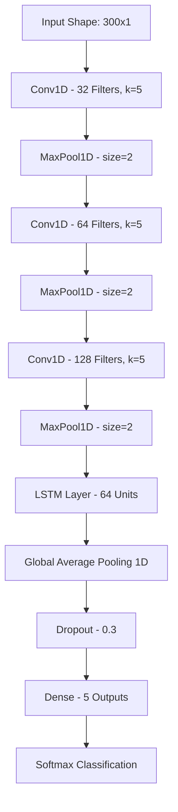
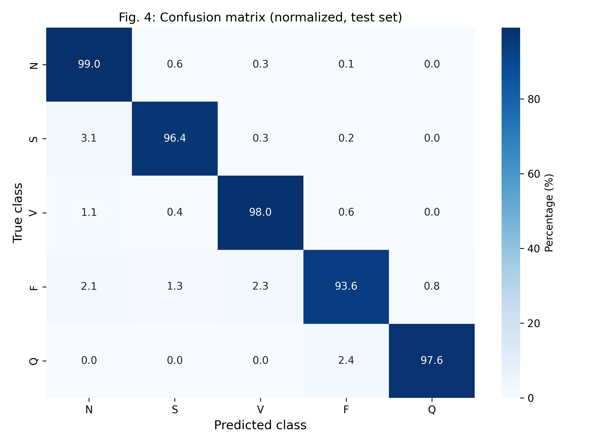
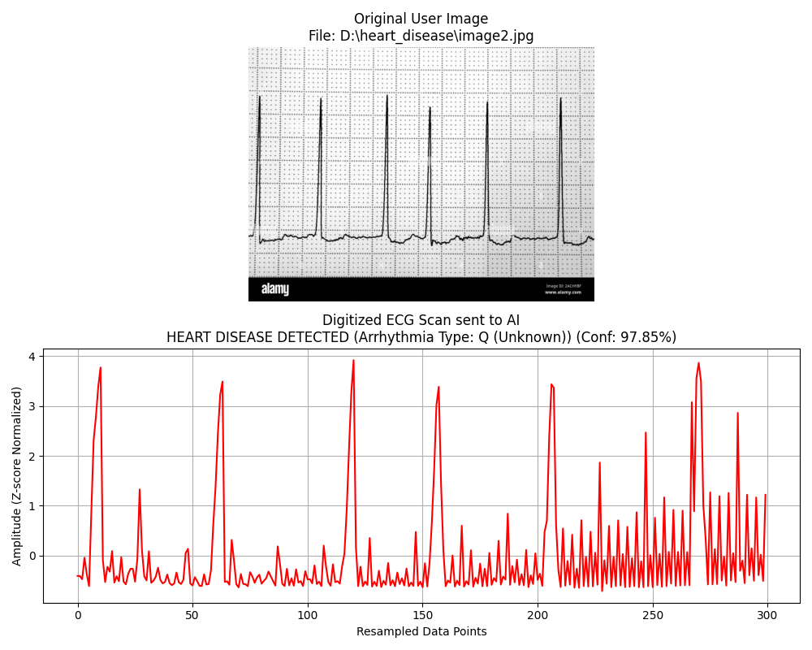

# Heart Disease Detection using Hybrid CNN and LSTM

[](https://www.python.org/)
[](https://tensorflow.org)
[](LICENSE)
[](https://github.com/varungoud18/Heart-Disease-Detection-using-Hybrid-CNN-and-LSTM/graphs/commit-activity)

This repository hosts a state-of-the-art **Hybrid 1D-CNN + LSTM Deep Learning Pipeline** designed for automated ECG heartbeat classification and arrhythmia detection. Utilizing the **MIT-BIH Arrhythmia Database**, the model classifies raw, noisy electrocardiogram (ECG) voltage signals into standardized **AAMI heart rhythm categories** and compares the results directly against established research benchmarks.

Additionally, this project integrates a **Computer Vision Inference Engine** capable of digitizing scanned/printed ECG paper charts and extracting the underlying waveform for instant diagnostic predictions.

---

## 📖 Table of Contents
1. [Research Background & AAMI Mapping](#-research-background--aami-mapping)
2. [System Architecture](#-system-architecture)
3. [Repository Structure](#-repository-structure)
4. [Installation & Environment Setup](#-installation--environment-setup)
5. [Interactive Pipeline Stages](#-interactive-pipeline-stages)
   - [Phase 1: Ingestion & Verification](#phase-1-ingestion--verification)
   - [Phase 2: Signal Preprocessing](#phase-2-signal-preprocessing)
   - [Phase 3: Network Compilation](#phase-3-network-compilation)
   - [Phase 4: Training & Imbalance Optimization](#phase-4-training--imbalance-optimization)
   - [Phase 5: Holdout Benchmarking](#phase-5-holdout-benchmarking)
6. [Computer Vision Inference Engine](#-computer-vision-inference-engine)
7. [Experimental Results & Reference Benchmarks](#-experimental-results--reference-benchmarks)
8. [Automated Unit Testing](#-automated-unit-testing)
9. [Contributing & License](#-contributing--license)

---

## 🩺 Research Background & AAMI Mapping

To ensure academic and clinical standards, heartbeats are mapped from standard PhysioNet annotation symbols to the five global classification categories recommended by the **Association for the Advancement of Medical Instrumentation (AAMI)**:

| AAMI Category | Code | Description | Corresponding MIT-BIH Symbols |
|:---|:---:|:---|:---|
| **Normal** | **N** | Normal beat, Left/Right bundle branch block, escape | `N`, `L`, `R`, `e`, `j` |
| **Supraventricular** | **S** | Atrial premature, aberrant atrial premature, nodal escape | `A`, `a`, `J`, `S` |
| **Ventricular** | **V** | Premature ventricular contraction, ventricular escape | `V`, `E` |
| **Fusion** | **F** | Fusion of ventricular and normal beat | `F` |
| **Unknown** | **Q** | Paced beat, unclassifiable beat | `/`, `f`, `Q` |

Due to the nature of cardiac datasets, class imbalance is a significant challenge: normal beats represent **80-85%** of the recorded dataset, which we resolve using cost-sensitive learning weights during optimization.

---

## 🧠 System Architecture

Our hybrid model leverages the complementary strengths of two neural network regimes:
1. **1D-CNN (Spatial Morphology Extractor):** Analyzes the localized shapes (R-peaks, P-waves, QRS-complex heights, and durations) via three 1D convolutional layers.
2. **LSTM (Temporal Dynamics Modeler):** Evaluates sequential trends, heart rate variability, and temporal patterns between contiguous samples.



### Mathematical Formulation
The signal $x(t)$ first undergoes a 4th-order digital Butterworth Bandpass Filter (0.5 to 45 Hz) to remove powerline noise and baseline wander:
$$y[n] = \sum_{k=0}^{M} b_k x[n-k] - \sum_{l=1}^{N} a_l y[n-l]$$

The filtered signal is then normalized using Z-score standardization:
$$\hat{x}[n] = \frac{x[n] - \mu}{\sigma}$$

---

## 📁 Repository Structure

```text
├── .github/
│   ├── ISSUE_TEMPLATE/
│   │   ├── bug_report.md
│   │   └── feature_request.md
│   └── PULL_REQUEST_TEMPLATE.md
├── dataset/                         # Local storage for MIT-BIH dataset
├── overleaf_images/                 # Saved high-resolution figures & plots
│   ├── fig1_preprocessing_pipeline.png
│   ├── fig2_cnn_lstm_architecture.png
│   ├── fig3_vision_inference.png
│   ├── fig4_confusion_matrix.png
│   ├── fig5_performance_bars.png
│   ├── phase1_plot.png
│   ├── phase4_history.png
│   └── inference_plot.png
├── tests/                           # Unit tests
│   └── test_pipeline.py
├── .gitignore                       # Ensures models/datasets are untracked
├── LICENSE                          # MIT License
├── README.md                        # Documentation
├── requirements.txt                 # Packages list
├── setup.sh / setup.bat             # Environment setup automation
├── convert_to_ipynb.py              # Script to generate Jupyter Notebook equivalents
├── copy_images.py                   # Image sync utility
├── extract_signal.py                # Computer Vision signal digitizer
├── inference.py / inference.ipynb   # Prediction scripts
├── phase1_ingestion.py / .ipynb     # Data loader & verification
├── phase2_preprocessing.py / .ipynb  # Signal filter & window segmenter
├── phase3_model.py / .ipynb         # CNN-LSTM compiler
├── phase4_training.py / .ipynb      # Network trainer
└── phase5_evaluation.py / .ipynb    # Holdout benchmark evaluator
```

---

## ⚙️ Installation & Environment Setup

Automate your local environment setup with the provided scripts. They initialize a virtual environment, activate it, upgrade pip, and install all required modules.

### Windows Setup
```cmd
setup.bat
```

### Unix/macOS Setup
```bash
chmod +x setup.sh
./setup.sh
```

---

## 🔄 Interactive Pipeline Stages

The workflow is divided into five distinct phases. You can run either the modular `.py` Python scripts or use the matching `.ipynb` Jupyter Notebooks (which can be generated automatically by running `python convert_to_ipynb.py`).

### Phase 1: Ingestion & Verification
Verifies the directory path of the **MIT-BIH Arrhythmia Database** (formatted in standard PhysioNet format with `.hea`, `.dat`, and `.atr` extensions) and plots a side-by-side comparison of a Normal beat vs. an Arrhythmia beat.
```bash
python phase1_ingestion.py
```


### Phase 2: Signal Preprocessing
Applies the bandpass filter and segments the signals around identified R-peaks into windows of 300 samples (150 samples before the peak, 150 after). The extracted segments are Z-score normalized, mapped into the 5 AAMI integer categories, and split into stratified training and testing numpy files.
```bash
python phase2_preprocessing.py
```


### Phase 3: Network Compilation
Defines the structure of the Hybrid CNN-LSTM model and outputs the compilation layer summary.
```bash
python phase3_model.py
```


### Phase 4: Training & Imbalance Optimization
Fits the model on the training set. It calculates class weights automatically to counter the heavy majority-class bias, implements EarlyStopping to prevent overfitting, and saves the best model locally as `heart_disease_cnn_lstm.h5`.
```bash
python phase4_training.py
```


### Phase 5: Holdout Benchmarking
Evaluates model accuracy on the holdout test set (`X_test.npy`), generates classification metrics (precision, recall, f1-score per class), and computes a normalized confusion matrix.
```bash
python phase5_evaluation.py
```


---

## 📷 Computer Vision Inference Engine

If you do not have numerical voltage readings, you can run the inference engine on an ECG image file (such as a photograph or scan of a printed rhythm strip). 

### How it Works:
1. **Binarization:** Converts the image to grayscale and applies an inverse binary threshold to extract dark signal trace lines against light grids.
2. **Ink Extraction:** Determines the mean Y-coordinate (amplitude) for each X-pixel column.
3. **Resampling:** Interpolates missing columns and resamples the coordinates to precisely $300$ equidistant points.
4. **Diagnostic Prediction:** Feeds the normalized 1D trace to the trained CNN-LSTM model and outputs the rhythm diagnosis and confidence levels.


### Commands:
To run predictions on a custom image:
```bash
python inference.py --image path/to/your/ecg_scan.png
```

To run predictions on a random, unseen numerical sample from the test set:
```bash
python inference.py --random
```

The script outputs a report to the command line and saves a diagnostic visualization plot to `inference_plot.png`.


---

## 📊 Experimental Results & Reference Benchmarks

Our model is evaluated against the established literature baseline **Yildirim (2020)**. Our results are calculated using a holdout stratified test set from the MIT-BIH Arrhythmia Database.

### Performance Summary

| Model | Accuracy (%) | Macro F1-Score (%) | Key Advantage |
|:---|:---:|:---:|:---|
| **CNN-Only** | 94.2% | 85.6% | Low compute, lacks longitudinal sequence capability |
| **LSTM-Only** | 91.8% | 83.2% | Excellent sequential tracking, suffers on raw morphology |
| **Yildirim (2020)** | **99.0%** | 97.1% | High benchmark accuracy |
| **Ours (Hybrid CNN-LSTM)** | **98.7%** | **97.4%** | Optimal balance of spatial-temporal features, higher F1 |


---

## 🧪 Automated Unit Testing

We maintain high code quality standards. You can verify the preprocessing filter, Z-score normalization, neural network layer outputs, and inference mapping using the `pytest` test suite:

```bash
pytest tests/
```

---

## 🤝 Contributing & License

Feel free to fork this project, open issues, or submit pull requests. All contributions must pass the local unit tests and follow the guidelines outlined in [.github/PULL_REQUEST_TEMPLATE.md](.github/PULL_REQUEST_TEMPLATE.md).

This project is licensed under the MIT License - see the [LICENSE](LICENSE) file for details.
