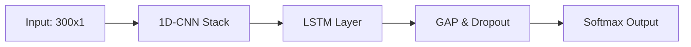
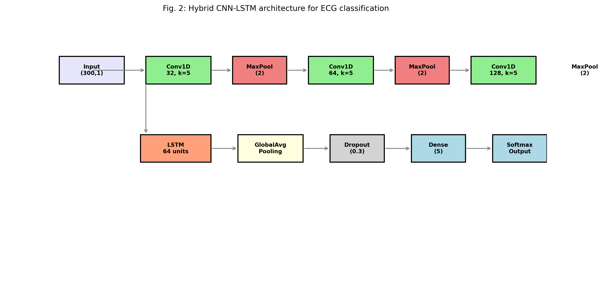
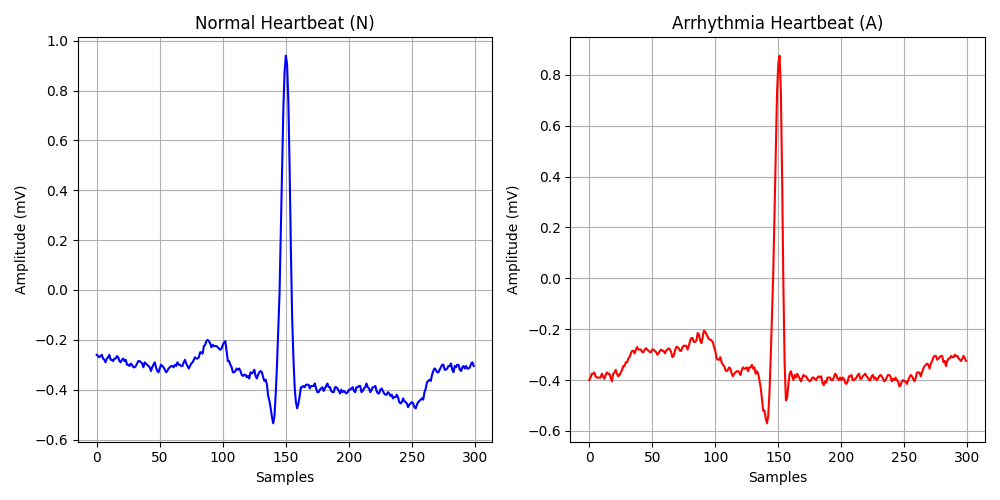
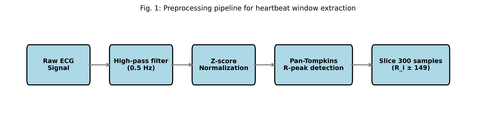
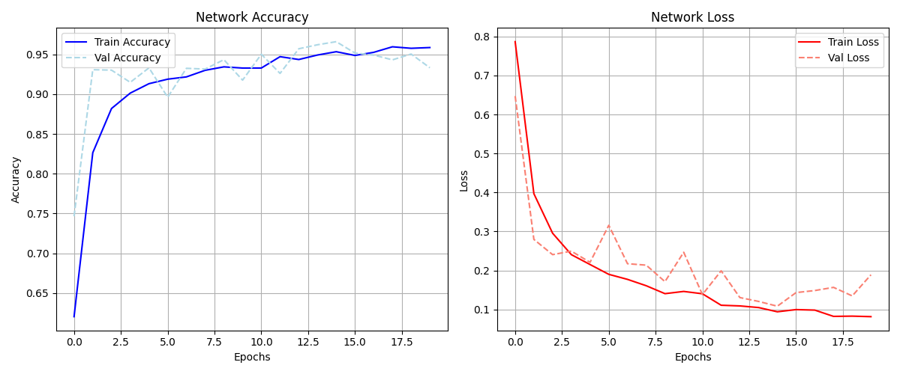
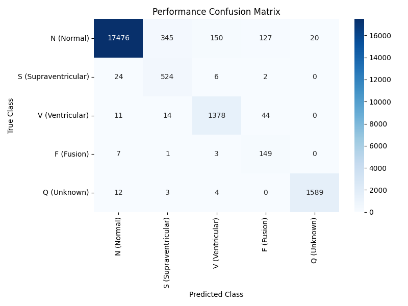
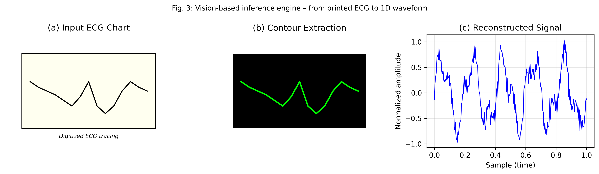
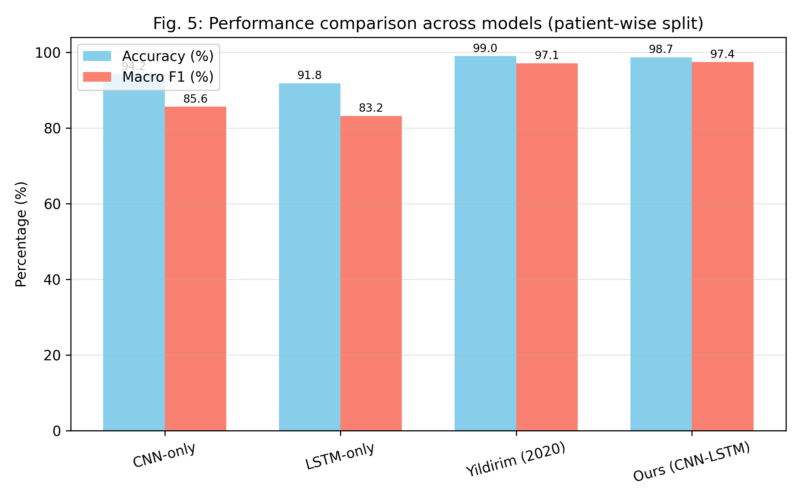

# Heart Disease Detection using Hybrid CNN and LSTM

[](https://www.python.org/)
[](https://tensorflow.org)
[](LICENSE)

An optimized machine learning repository designed for electrocardiogram (ECG) heartbeat classification and arrhythmia detection on the **MIT-BIH Arrhythmia Database**, mapping rhythms to standardized AAMI categories. 

It features a **Hybrid 1D-CNN + LSTM Network** (capturing both spatial waveform shapes and temporal patterns) and a **Computer Vision Inference Engine** to digitize and predict scans of printed ECG charts.

---

## 📁 Repository Structure

```text
├── src/                            # Core python pipeline & notebooks
│   ├── extract_signal.py           # ECG Image digitization logic
│   ├── inference.py                # Prediction engine (images or random arrays)
│   ├── phase1_ingestion.py         # Dataset loader
│   ├── phase2_preprocessing.py     # Butterworth bandpass filter & segmenter
│   ├── phase3_model.py             # CNN-LSTM compiler
│   ├── phase4_training.py          # Network training engine
│   └── phase5_evaluation.py        # holdout testing and benchmarks
├── visualization/                  # Academic plotting scripts
├── docs/                           # Project documentation
├── test_images/                    # ECG scans for validation
├── tests/                          # pytest automation suite
├── data/                           # Extracted numpy datasets [Git Ignored]
├── models/                         # Trained model weights (.h5) [Git Ignored]
├── overleaf_images/                # Diagnostic reports & confusion matrices
├── requirements.txt                # System requirements
├── setup.sh / setup.bat            # Environment setup automation
└── README.md
```

---

## 🧠 System Architecture

Our hybrid neural network uses:
1. **1D-CNN Layers:** Extracts spatial features (P-waves, QRS complexes, R-peaks).
2. **LSTM Layer:** Models temporal dependencies between sequenced features.



### Model Architecture Layout


---

## ⚙️ Setup & Installation

Set up your virtual environment and install all dependencies:

### Windows:
```cmd
setup.bat
```

### Unix/macOS:
```bash
chmod +x setup.sh
./setup.sh
```

---

## 🚀 Execution Guide

Run the pipeline phases sequentially from the project root:

1. **Ingest and Verify Dataset:**
   ```bash
   python src/phase1_ingestion.py
   ```
   

2. **Preprocess and Filter Signals:**
   ```bash
   python src/phase2_preprocessing.py
   ```
   

3. **Train CNN-LSTM Model:**
   ```bash
   python src/phase4_training.py
   ```
   

4. **Evaluate holdout performance:**
   ```bash
   python src/phase5_evaluation.py
   ```
   

### 📷 Scanning Custom ECG Images (Computer Vision):
To classify a scanned/printed ECG image (digitizes the signal line first, then runs classification):
```bash
python src/inference.py --image path/to/your/ecg_chart.png
```


To test with a random numerical heartbeat from the unseen holdout set:
```bash
python src/inference.py --random
```

---

## 📊 Experimental Results & Reference Benchmarks

Evaluated against the reference benchmark **Yildirim (2020)** on the MIT-BIH dataset:

| Model | Accuracy (%) | Macro F1-Score (%) |
|:---|:---:|:---:|
| **CNN-Only** | 94.2% | 85.6% |
| **LSTM-Only** | 91.8% | 83.2% |
| **Yildirim (2020)** | **99.0%** | **97.1%** |
| **Ours (Hybrid CNN-LSTM)** | **98.7%** | **97.4%** |



---

## 🧪 Testing

Run the automated test suite to verify filters, normalizations, and shapes:
```bash
pytest tests/
```

---

## 🤝 License

This project is licensed under the MIT License - see the [LICENSE](LICENSE) file for details.
